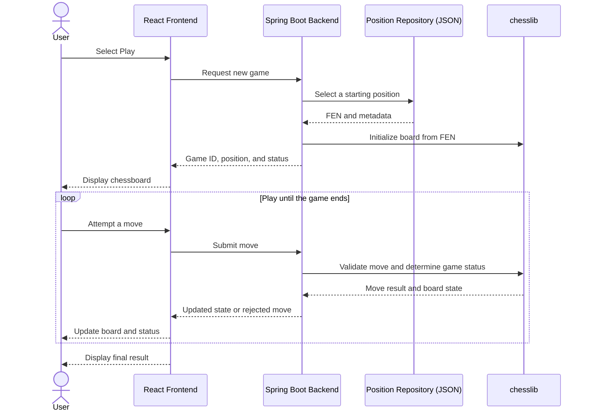

# Drop in Chess --- Design Document

## 1. Overview

### 1.1 Vision

What Drop in Chess is and what experience is it trying to create?

Drop in Chess is a chess experience that places players directly into
curated middlegame and endgame positions rather than starting from the
standard opening position. It is intended to reduce the emphasis on
opening theory and let players spend more of their games practicing
positional, tactical, and endgame decision-making.

### 1.2 Problem

Describe the problem or limitation the project is trying to address.

Questions to consider: - What part of traditional chess are you trying
to skip or improve? - Starting chess games at the Opening phase can be
repetitive and boring, so this gives players more options on how to
play - Who is this experience for? - For all players interested in
skipping over the opening phase or looking for a new way to play - What
makes middlegame/endgame positions interesting? - Tests calculation,
positional judgment, tactical awareness, and endgame technique rather
than opening preparation.

------------------------------------------------------------------------

## 2. Goals

List the main goals of the project.

-   Load players into a random position
-   positions are playable
-   allow players to play the chess game from a starting position to a
    valid end state locally
-   there are multiple game states the player can start from
-   support standard game actions such as offering a draw and resigning
-   The board should visually indicate legal destination squares when a
    piece is selected.

### 2.1 Non-Goals

List features or problems that are intentionally out of scope for the
initial version.

-   online multiplayer
-   elo system
-   live engine evaluation during gameplay
-   turn by turn evaluation

------------------------------------------------------------------------

## 3. MVP Requirements

Define the smallest version of Drop in Chess that proves the core idea
works.

### 3.1 Functional Requirements

For the MVP:

-   The system must select a starting position from multiple eligible
    positions.
-   The system must initialize a game from a valid middlegame or endgame
    position.
-   The system must allow legal chess moves and reject illegal moves.
-   The system must detect valid game-ending conditions.

### 3.2 Non-Functional Requirements

-   Correctness: The application should not allow invalid chess states
    or illegal moves.
-   Responsiveness: Moves and board updates should feel immediate during
    local play.
-   Maintainability: Chess/game logic should be separated from UI and
    HTTP/controller logic, so it can be tested and extended later.
-   Reliability: Starting positions should load consistently without
    crashing the application.

------------------------------------------------------------------------

## 4. User Flow

Describe what happens from the player's perspective.

1.  User opens Drop in Chess.
2.  User starts a new game by selecting Play.
3.  System selects a starting position from the available positions.
4.  The selected position is displayed on the chessboard.
5.  User plays both sides locally, with illegal moves rejected.
6.  The board updates after each legal move.
7.  Play continues until a valid game-ending condition occurs.
8.  The game result is displayed.
9.  User may start another game, returning to step 2.

------------------------------------------------------------------------

## 5. Starting Position Requirements

Starting-position sourcing, offline filtering, and collection targets are defined in the [Position Generation Workflow](Position-Generation-Workflow.md). The requirements below summarize that plan.

Questions to answer:

-   What counts as a middlegame or endgame position?
    -   MidGame Estimate: at least after 10 - 15 moves after the first
        move and before the condition for endgame state
    -   Endgame estimate: approximately 12--14 points of non-pawn
        material remaining per side.
-   What makes a position valid and playable?
    -   A starting position must represent a valid chess state from
        which legal play can continue.
-   Are materially or positionally imbalanced positions allowed in V1?
    -   Material imbalance is allowed if Stockfish rates the position within the configured balance window; see the [Position Generation Workflow](Position-Generation-Workflow.md).
-   Should positions with forced checkmate be excluded?
    -   Reject mate scores found at the configured search budget; finite analysis cannot guarantee there is no deeper forced mate.
-   Should positions come from real games?
    -   Yes, from Lichess Elite PGNs; see the [Position Generation Workflow](Position-Generation-Workflow.md).
-   Should the same position be reusable?
    -   Yes
-   How will position difficulty eventually be determined?
    -   Position difficulty: Can difficulty be estimated based on the
        number of viable moves and the evaluation loss associated with
        alternative moves?

------------------------------------------------------------------------

## 6. System Architecture

Describe the major parts of the system and their responsibilities.

### 6.1 Frontend

Technology: - React - TypeScript - Vite

Responsibilities:

-   Render the chessboard.
-   Display game information.
-   Receive user input.
-   Communicate with the backend.

### 6.2 Backend

Technology: - Java - Spring Boot - Maven

Responsibilities for V1:

-   Manage the local game state.
-   Validate player actions and moves.
-   Select starting positions.
-   Provide game state and position data to the frontend.
-   Detect and report game-ending conditions.

Online multiplayer communication and matchmaking are intentionally
deferred until a later version.

### 6.3 Position Storage / Database

Technology: JSON collection loaded into memory. The offline importer produces the collection described in the [Position Generation Workflow](Position-Generation-Workflow.md). A database is not required for V1.

Future database responsibilities may include:

-   Store starting positions and associated metadata.
-   Store completed games.
-   Store users.
-   Store ratings.

### 6.4 Backend Chess Rules

Library: chesslib

https://github.com/bhlangonijr/chesslib/tree/master

Backend Responsibilities:

-   Validate legal moves.
-   Detect check.
-   Detect checkmate.
-   Detect draws.
-   Generate updated positions.

### 6.5 Frontend Chess Rules

Library: chess.js

https://www.npmjs.com/package/chess.js

Frontend Responsibilities:

- Load FEN positions received from the backend.
- Validate moves locally for responsive gameplay.
- Generate legal moves for UI features such as move highlighting.
- Apply moves locally for immediate board updates.
- Maintain a local representation of the current position.
- Generate the local FEN when needed.

### 6.6 Chessboard UI

Library: react-chessboard

https://www.npmjs.com/package/react-chessboard

Frontend Responsibilities:

- Render chess positions.
- Display pieces and board orientation.
- Handle piece drag-and-drop/click interactions.
- Display move highlighting and other board indicators.
- Pass attempted moves to the frontend game logic.
- Update the displayed position when game state changes.

### 6.7 Offline Position Analysis

Stockfish evaluates candidate positions during offline generation to select even starting positions. It does not provide live evaluation during gameplay. PGN sourcing, candidate selection, engine filtering, and output metadata are covered in the [Position Generation Workflow](Position-Generation-Workflow.md).

Position difficulty and post-game analysis remain future features.

------------------------------------------------------------------------

## 7. Architecture Diagram

This sequence shows the intended local gameplay flow. Starting positions are prepared offline as described in the [Position Generation Workflow](Position-Generation-Workflow.md); Stockfish does not run during gameplay.



The frontend uses chess.js for responsive move interaction and highlighting. The backend owns the authoritative game state. Draw offers and resignation also go through the backend; they are omitted here to keep the main sequence readable.

WebSockets, matchmaking, user accounts, and ratings remain future concerns. The separate offline sourcing and engine-filtering sequence is in the [Position Generation Workflow](Position-Generation-Workflow.md#import-sequence).

------------------------------------------------------------------------

## 8. Domain Model

Identify the important concepts in the application.

Possible entities to investigate:
application.


### Game

Potential responsibilities/data:

-   ID
-   Starting position
-   Current position
-   Current turn
-   Status
-   Result

V1 is played locally by one user controlling both sides, so separate
online player entities are not required yet.

### Position

Potential responsibilities/data:

-   FEN
-   Game phase
-   Source

Offline evaluation and source metadata are described in the [Position Generation Workflow](Position-Generation-Workflow.md). Difficulty classification remains a future concern.

### Move

Potential responsibilities/data:

-   Starting square
-   Destination square
-   Promotion
-   Move number
-   Side to move

These are initial ideas, not finalized classes.

------------------------------------------------------------------------

## 9. API Design

Document backend endpoints as they are designed.

### Example

`GET /api/health`

Purpose: Verify that the backend is running.

Response:

``` json
{
  "status": "ok"
}
```

### Future Endpoints

Potential endpoints:

``` text
POST /api/games
GET  /api/games/{gameId}
POST /api/games/{gameId}/moves
GET  /api/positions/random
```

Do not finalize these until the required behavior is understood.

------------------------------------------------------------------------

## 10. Real-Time Communication --- Future

Real-time multiplayer communication is not required for V1 because games
are played locally by one user controlling both sides.

A future multiplayer version may use WebSockets for live game updates.
Questions to address at that stage include:

-   Which events need to be sent in real time?
-   Who owns authoritative game state?
-   What happens if a player disconnects?
-   How are invalid or outdated moves handled?

------------------------------------------------------------------------

## 11. Data Model

Document persistent data once database requirements become clearer.

V1 stores generated positions in JSON, with fields defined in the [Position Generation Workflow](Position-Generation-Workflow.md). A relational database can be introduced later.

Potential future tables:

``` text
users
games
positions
moves
ratings
```

For each table, eventually document:

-   Primary key
-   Important fields
-   Relationships
-   Constraints

------------------------------------------------------------------------

## 12. Key Technical Decisions

Record important architectural decisions and the reasoning behind them.

### Decision: V1 Is Local-Only

**Reason:**

The first version is intended to prove the core Drop in Chess mechanic:
selecting a non-opening position and playing it correctly to completion.
Online multiplayer, matchmaking, accounts, and network synchronization
are deferred until the local game loop works.

### Decision: Offline Position Evaluation

**Reason:**

Use Stockfish during generation to select even positions from real games, then load the saved collection during gameplay. This keeps engine work outside the interactive game loop. Source selection, filtering, and JSON storage are defined in the [Position Generation Workflow](Position-Generation-Workflow.md).

### Decision: Java + Spring Boot Backend

**Reason:**

The backend uses Java and Spring Boot to provide a structured, strongly typed environment for managing game state, validating moves, 
retrieving positions, and exposing the application's API. Spring Boot's 
controller, service, and repository patterns provide clear separation 
between API handling, game logic, and persistence, making the backend 
easier to test and extend. Spring Data JPA reduces persistence boilerplate 
while still allowing custom queries when needed for position selection. 
Java's mature concurrency model also provides a solid foundation if the 
application later expands to support multiple simultaneous games. Spring's 
WebSocket and STOMP support provides a natural path toward the real-time 
multiplayer features planned for V2.

### Decision: React + TypeScript Frontend

**Reason:**

The frontend uses React to organize the application into reusable components 
such as the chess board, game controls, timer, move history, and position 
information. React's state-driven model fits the interactive nature of a 
chess application, where the interface must update in response to moves and 
backend responses. TypeScript provides compile-time type checking for 
application-specific structures such as FEN positions, moves, game state, 
and API request/response objects. This reduces the likelihood of frontend 
errors and helps keep the contract between the React frontend and Spring 
Boot backend explicit.

### Decision: Vite

**Reason:**

Vite provides the development and build tooling for the React frontend. 
Because the application uses a separate Spring Boot backend, the frontend 
does not require its own application server or full-stack framework. 
Vite provides a lightweight development environment with fast hot module 
replacement while producing optimized static assets for production. 
This keeps the frontend architecture simple while allowing React and 
TypeScript to remain focused on the client-side user experience.

### Decision: Monorepo

**Reason:**

TBD.

Add new decisions as the architecture evolves.

### Future Option: Supabase (PostgreSQL)

V1 uses the JSON collection defined in the [Position Generation Workflow](Position-Generation-Workflow.md). Supabase/PostgreSQL can be considered later for persistent games, users, and position management without redeploying the application.

### Decision: OpenAI's GPT-4o/Anthropic's Claude

**Reason:**

Use to add a theme and description of the starting position. To reduce  hallucinations send :
-  The FEN
- the last 5 to 10 moves 

**Estimated Cost:** $1.50/10,000 positions [Roughly $0.00015 per position] - GPT estimate

**Estimated Time:** 500 positions/min

For game sourcing and replay, follow the [Position Generation Workflow](Position-Generation-Workflow.md). Historical moves may provide context for future descriptions; description generation remains separate from the initial import pipeline.

Common Themes [set as an enum]:
- PASSED_PAWN
- ROOK_ENDING
- MINOR_PIECE
- OPPOSITE_BISHOPS
- QUEEN_ENDING
- ATTACKING_KING
- CENTER_STRUGGLE
- PAWN_STORM

can be done mathematically

### Decision: Docker

------------------------------------------------------------------------

## 13. Security Considerations

Eventually consider:

-   Authentication
-   Authorization
-   Input validation
-   Cheating prevention
-   Server-authoritative game state
-   Database credentials
-   Environment variables

Not all of these need to be implemented for the first prototype.

------------------------------------------------------------------------

## 14. Testing Strategy

Potential testing layers:

### Backend

-   Unit tests
-   Service tests
-   API/integration tests

### Frontend

-   Component tests
-   User interaction tests

### Game Logic

-   Valid moves
-   Invalid moves
-   Checkmate
-   Draw conditions
-   Promotion
-   Castling
-   En passant

------------------------------------------------------------------------

## 15. Development Milestones

### Milestone 1 --- Project Setup

-   [x] Create Git repository
-   [x] Initialize Spring Boot backend
-   [x] Initialize React/TypeScript frontend with Vite
-   [x] Create backend health endpoint
-   [x] Connect frontend to backend

### Milestone 2 --- Local Chess Prototype

-   [x] Load a starting position from FEN
-   [x] Display the position
-   [x] Allow legal moves
-   [x] Update game state
-   [x] Detect game completion

### Milestone 3 --- Position System (Complete)

-   [x] Store candidate positions
-   [x] Select a starting position
-   [x] Define eligibility rules
-   [x] Source positions from real games using the [Position Generation Workflow](Position-Generation-Workflow.md)
-   [x] Filter positions offline with Stockfish and produce the 500/500 JSON collection
-   [x] Preserve source move history, opening metadata, and generation settings
-   [x] Support duplicate filtering, phase quotas, and resumable JSON checkpoints
-   [x] Load the completed collection into the backend for new games

Verified with 37 passing backend tests, including all 1,000 published positions and both position-selection HTTP endpoints.

### Milestone 4 --- Multiplayer

-   [x] Create game sessions
-   [ ] Match two players
-   [ ] Add WebSocket communication
-   [ ] Synchronize moves
-   [ ] Handle disconnects

### Milestone 5 --- Persistent Application

-   [ ] Add PostgreSQL
-   [ ] Store users
-   [ ] Store games
-   [ ] Store positions
-   [ ] Store results

### Milestone 6 --- Extended Features

-   [ ] Extended position analysis beyond the initial offline balance filter
-   [ ] Ratings
-   [ ] Position difficulty
-   [ ] Matchmaking preferences
-   [ ] Game history
-   [ ] Post-game analysis

------------------------------------------------------------------------

## 16. Open Questions

Keep unresolved design questions here rather than forcing an early
decision.

-   Sourcing and offline evaluation follow the [Position Generation Workflow](Position-Generation-Workflow.md). Its open decisions cover phase definitions, sampling, and engine budget.
-   What evaluation range should eventually count as balanced?
-   Should players eventually know the starting evaluation?
-   How should ratings account for unequal positions in a future
    multiplayer version?
-   How should position difficulty be measured?
-   What chess library should the Java backend use?
-   What Stockfish search budget should the offline importer use? See the [Position Generation Workflow](Position-Generation-Workflow.md).

------------------------------------------------------------------------

## 17. Future Ideas

Features that are interesting but are not part of the initial MVP.

-   Puzzle-derived positions
-   Start one move before a tactical mistake
-   Difficulty-based matchmaking
-   Opening continuation positions
-   Position voting
-   Post-game engine analysis
-   Position source/history
-   Spectating
-   Tournaments
