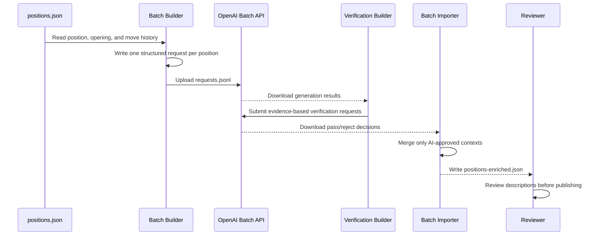

# Position Enrichment Workflow

This offline workflow adds three optional, progressively more helpful sections to curated positions:

- `openingContext`: how the source opening developed into the dropped-in position.
- `positionGuide`: a neutral explanation of the current position and a short list of themes.
- `possiblePlans`: one broad, plausible plan for White and one for Black.

The OpenAI API is never called during gameplay. The source collection remains unchanged until reviewed results are merged into a new JSON file.

For how positions are sourced and filtered before this step, see the [Position Generation Workflow](Position-Generation-Workflow.md).



## How the pieces fit together

The workflow deliberately separates four responsibilities:

| Responsibility | Owner | Network access? | Changes the source collection? |
| --- | --- | --- | --- |
| Choose positions and construct prompts | `EnrichmentBatchBuilder` | No | No |
| Start and retrieve both batches | OpenAI API commands | Yes | No |
| Build factual review requests | `EnrichmentVerificationBatchBuilder` | No | No |
| Validate responses and attach approved context | `EnrichmentBatchImporter` | No | No; it writes a new file |
| Rebuild rejected descriptions | `EnrichmentRetryBatchBuilder` | No | No |
| Select the operation and parse arguments | `PositionEnrichmentCli` | No | No |

This separation makes the paid API call a visible step between two local, repeatable operations. A malformed response cannot silently replace the published collection, and changing the prompt does not require changing gameplay code.

The files move through these stages:

```text
positions.json
    |
    | PositionEnrichmentCli build
    v
pilot-v5-requests.jsonl
    |
    | OpenAI Batch API
    v
pilot-v5-results.jsonl
    |
    | PositionEnrichmentCli build-verification
    v
pilot-v5-verification-requests.jsonl
    |
    | OpenAI Batch API
    v
pilot-v5-verification-results.jsonl
    |
    | PositionEnrichmentCli merge-verified
    v
positions-enriched-pilot-v5.json
    |
    | manual chess review and later publication
    v
runtime positions.json
```

The generated files under `backend/generated/enrichment/` are working artifacts. They are ignored by Git. The classpath resource under `backend/src/main/resources/positions/` is the published runtime collection and should only be replaced after review.

## Class guide

All production classes are under:

```text
backend/src/main/java/com/dropinchess/positionenrichment/
```

### `PositionEnrichmentCli`

This is the entry point used by IntelliJ and the command line. It contains no enrichment rules itself. Its job is to:

1. Read the first argument as the operation name.
2. Validate the number of arguments.
3. Convert path, limit, and model strings into Java values.
4. Call either `EnrichmentBatchBuilder.build(...)` or `EnrichmentBatchImporter.merge(...)`.
5. Print the number of records written and the absolute output path.

It supports six operations:

```text
build <positions.json> <requests.jsonl> [limit=25] [model=gpt-6-luna]
build-missing <positions.json> <requests.jsonl> [model=gpt-6-luna]
merge <positions.json> <batch-results.jsonl> <positions-enriched.json>
build-verification <positions.json> <generation-results.jsonl> <verification-requests.jsonl> [model=gpt-6-luna]
merge-verified <positions.json> <generation-results.jsonl> <verification-results.jsonl> <positions-enriched.json>
build-retries <positions.json> <verification-results.jsonl> <retry-requests.jsonl> [model=gpt-6-luna]
report-verification <verification-results.jsonl>
```

The default limit of 25 protects against accidentally preparing the entire collection while tuning the prompt. The CLI does not read `OPENAI_API_KEY` and does not make HTTP requests.

### `EnrichmentBatchBuilder`

This class converts the curated position collection into an OpenAI Batch API input file. Its output is JSONL: one complete JSON request per line.

#### Input records

`CollectionFile` is the small view of the top-level position collection that this step needs:

- `schemaVersion` guards against reading an incompatible collection format.
- `complete` prevents enrichment of a partial generator checkpoint.
- `positions` contains the candidate records.

`EnrichmentPosition` is a projection of one saved position. Unknown JSON properties are ignored because the enrichment step does not need selection or engine details. It reads:

- stable position ID;
- middlegame or endgame phase;
- optional endgame material category;
- FEN;
- SAN move history and ply count;
- ECO, opening name, and optional variation.

#### `build(...)`

`build` coordinates local request generation:

1. Validate the limit and model name.
2. Deserialize the input collection with Jackson.
3. Require a complete, nonempty schema-version-1 collection.
4. Call `selectPositions` for a pilot or full run.
5. Validate each selected position has the fields needed by the prompt.
6. Create one Batch API request object.
7. Serialize it as a single compact line followed by a newline.

The method uses `writeValueAsString` before writing to the shared `BufferedWriter`. Calling Jackson's `writeValue` directly with the writer would let Jackson close it after the first record, producing a `Stream closed` failure on the second position.

#### `selectPositions(...)`

When the limit is smaller than the collection, selection creates a useful review sample:

- half middlegames, rounded up;
- half endgames, rounded down;
- endgames selected in rounds across the available material categories;
- remaining slots filled from positions not already selected if a phase is short.

The procedure is deterministic. Running it again with the same input and limit gives the same position IDs. When the limit includes the entire collection, every position is retained in its original order.

This selection is only for prompt evaluation. It does not replace the randomized selection used while sourcing positions; see the [Position Generation Workflow](Position-Generation-Workflow.md).

#### Prompt construction

`systemPrompt` defines rules that apply to every position. It tells the model to use only supplied evidence. It permits broad plans but forbids:

- best moves;
- tactical solutions;
- engine scores;
- forced-result claims;
- forcing lines or exact move instructions.

`buildPrompt` provides the position-specific evidence and requests all three UI sections. Missing opening or ECO tags receive readable fallback text instead of the string `null`.

`EnrichmentFacts` parses the FEN locally and supplies named evidence for side to move, check status, every piece type and square, exact counts, material comparisons, king locations and board regions, bishop-square colors, and castling rights. Chesslib calculates whether the side to move is in check. These same facts are stored locally under `verifiedFacts`; the model does not create them.

`responseFormat` creates the strict Structured Outputs schema. Every successful model response must contain:

```json
{
  "openingContext": {
    "summary": "string"
  },
  "positionGuide": {
    "summary": "string",
    "themes": ["two", "to", "five", "labels"],
    "evidenceIds": ["CHECK_STATUS"]
  },
  "possiblePlans": {
    "white": {
      "summary": "one broad plan",
      "evidenceIds": ["WHITE_MATERIAL"]
    },
    "black": {
      "summary": "one broad plan",
      "evidenceIds": ["BLACK_MATERIAL"]
    }
  }
}
```

Every object sets `additionalProperties` to `false`, and all properties are required. Evidence IDs are constrained to the IDs supplied for that exact position. This prevents the model from citing nonexistent evidence, while the second batch checks whether the cited evidence actually supports the prose.

### `EnrichmentVerificationBatchBuilder`

This class reads completed generation results and creates a second Batch API file. Each verification request contains the candidate context, the original metadata and move history, and the independently calculated evidence. The reviewer returns only `approved` and an `issues` array. It rejects factual contradictions, irrelevant evidence, omitted immediate checks, tactical solutions, best moves, forcing lines, engine evaluations, and forced-result claims. Verification requests use a 1,200-token output ceiling so the reviewer has enough room for reasoning and its structured result.

### `EnrichmentRetryBatchBuilder`

This class reads verification results and creates new generation requests only for rejected position IDs. Approved positions are not billed or generated again.

#### Batch request shape

Each line written by the builder has four outer fields:

```json
{
  "custom_id": "position-<stable position ID>",
  "method": "POST",
  "url": "/v1/responses",
  "body": {
    "model": "gpt-6-luna",
    "input": [],
    "reasoning": {
      "effort": "low"
    },
    "max_output_tokens": 1200,
    "text": {
      "format": {}
    }
  }
}
```

`custom_id` is the join key. Batch result order is not guaranteed to match request order, so the importer must use this ID rather than line number.

### `EnrichmentBatchImporter`

This class reads downloaded OpenAI result JSONL and adds valid contexts to an in-memory copy of the original collection.

#### `merge(...)`

`merge` performs the following checks and transformations:

1. Deserialize the original collection as maps so every existing field is preserved.
2. Index its positions by stable ID and reject duplicate IDs.
3. Read the result file one line at a time.
4. Require `custom_id` to begin with `position-` and match an existing position.
5. Refuse to overwrite a position that already has `context`.
6. Require an HTTP 200 Batch API response.
7. Extract the model's `output_text` from the Responses API body.
8. Parse and validate the generated JSON and its evidence IDs.
9. Add deterministic `verifiedFacts`, generation metadata, and the resulting `context` object.
10. Atomically write a new enriched collection.

The method accepts partial pilot results: a 25-response result file enriches those 25 matching positions while leaving the other 975 unchanged. It rejects a result file that does not contain any successful position responses.

#### `outputText(...)`

A Responses API body contains an `output` array. `outputText` searches it for a message item and then for an `output_text` content item. It does not assume that the first output entry contains the text. If no text exists, the merge fails with the affected position ID in the error.

#### `validateContext(...)`

The importer validates the model output again even though the request used Structured Outputs. It requires:

- exactly `openingContext`, `positionGuide`, and `possiblePlans` at the model-generated level;
- nonblank opening and position summaries;
- two to five nonblank theme strings.
- one nonblank broad plan for each side;
- one to five valid evidence IDs for the current guide and each plan.

`merge-verified` additionally requires one verification result for every generated description. Approved entries receive `availability: AVAILABLE` and `quality: AI_VERIFIED`. Rejected entries receive `availability: UNAVAILABLE`, `quality: AI_REJECTED`, and the player-facing fallback `Unable to generate reliable positional guidance for this position.` The rejected prose is discarded, while verification issues remain under generation metadata for debugging. A verification response that ends as `incomplete` is also converted to this safe rejected state, including the reason in its internal issues. Rejected IDs are still printed for optional retrying, and a later approved retry may replace an unavailable context.

This second validation protects the stored JSON if a result came from a different request, model, prompt version, or manually edited file.

#### Generation metadata

The model does not generate the `generation` object. The importer adds it locally:

- `model`: actual model value returned by the Responses API;
- `promptVersion`: current builder prompt version;
- `generatedAt`: merge time in UTC;
- `reviewStatus`: initially `UNREVIEWED`.

`availability` is the frontend contract. `quality` records whether content passed the AI verification gate. These named states are preferable to an uncalibrated numerical confidence score.

Keeping this metadata separate makes prompt revisions and selective regeneration traceable.

#### Atomic output

`writeAtomically` first writes a complete temporary JSON file beside the requested output. It then replaces the destination with an atomic move when the filesystem supports it, with a normal replacement fallback. If serialization fails, the destination is not left half-written, and the temporary file is cleaned up.

### `EnrichmentBatchBuilderTest`

This test class uses JUnit 5 and `@TempDir`, so it does not edit project files or call OpenAI. It verifies that:

- multiple input positions produce multiple JSONL lines;
- the stable ID, endpoint, model, prompt history, and strict schema are present;
- a pilot is balanced between phases and varies endgame types;
- incomplete source collections are rejected.

The multiple-record check specifically prevents regression of the closed-writer bug.

### `EnrichmentBatchImporterTest`

This test class constructs a small result that follows the Responses API structure. It verifies that:

- generated context is attached to the matching position;
- unrelated fields such as FEN remain unchanged;
- local generation metadata is added;
- failed API responses are rejected instead of being merged.

## Data ownership and current runtime boundary

The enrichment package remains an offline preparation tool: Java does not submit the API requests and normal gameplay never launches Stockfish. The completed `positions-enriched-v5.json` collection is published as `backend/src/main/resources/positions/positions.json`, which is the backend's default game source.

`PositionRepository` validates and retains each position's player-facing context. When a random position starts a game, `Game` keeps its position ID, phase, and context for the life of the session. `GameResponse` returns those values both when the game is created and when it is restored by session ID. Internal evidence and generation metadata are deliberately omitted from the runtime projection.

The Play page renders `openingContext`, `positionGuide`, and `possiblePlans` as independent collapsed controls, allowing a player to reveal only the amount of help they want. It also displays the ECO/opening provenance, source-game link, phase, side to move, and copyable FEN. An unavailable context supplies its fallback message instead of generated prose.

## Failure behavior

| Failure | Where it is detected | Outcome |
| --- | --- | --- |
| Partial or incompatible position collection | Builder | No request file is accepted as complete work |
| Position lacks ID, FEN, phase, or move history | Builder | Build stops before API submission |
| Batch returns non-200 status | Importer | Merge stops and names the position |
| Batch result ID is unknown | Importer | Merge stops instead of attaching text to the wrong position |
| Model output is absent or malformed | Importer | Merge stops before writing the destination |
| Position already has context | Importer | Existing context is preserved |
| Final serialization or move fails | Importer | Temporary file is cleaned up; source collection is unchanged |

Because the importer writes only after processing all result lines, a failure does not leave a partially written output file.

## Files and safety

Generated working files belong under `backend/generated/enrichment/`, which Git ignores. Do not overwrite `backend/src/main/resources/positions/positions.json` while experimenting.

Keep the API key in the `OPENAI_API_KEY` environment variable. Do not paste it into source code, JSON, an IntelliJ program argument, a chat, or Git. The local build and merge commands do not need the key; only the upload, status, and download commands use it.

## 1. Build a 25-position pilot

The entry point is `com.dropinchess.positionenrichment.PositionEnrichmentCli`. In IntelliJ, open `PositionEnrichmentCli`, click the green arrow beside `main`, and create a run configuration with the repository root as the working directory and these program arguments:

```text
build "backend/src/main/resources/positions/positions.json" "backend/generated/enrichment/pilot-v5-requests.jsonl" 25 gpt-6-luna
```

From a PowerShell terminal in `backend`, the equivalent command is:

```powershell
.\mvnw.cmd spring-boot:run `
  '-Dspring-boot.run.main-class=com.dropinchess.positionenrichment.PositionEnrichmentCli' `
  '-Dspring-boot.run.arguments=build src/main/resources/positions/positions.json generated/enrichment/pilot-v5-requests.jsonl 25 gpt-6-luna'
```

Each JSONL line targets `/v1/responses`, uses the position ID as `custom_id`, and requests a strict JSON schema. A limited pilot is balanced between middlegames and endgames, with its endgame half distributed across available endgame categories. A limit large enough for the entire collection includes every position. The prompt includes FEN, phase, endgame category when present, opening metadata, and the exact SAN history. It explicitly excludes best moves, tactical solutions, engine scores, and forced-result claims.

## 2. Put the API key in the current PowerShell session

This reads the key without displaying it or putting it directly in command history. It remains available only to processes launched from this terminal session.

```powershell
$secureOpenAiKey = Read-Host 'OpenAI API key' -AsSecureString
$env:OPENAI_API_KEY = [System.Net.NetworkCredential]::new('', $secureOpenAiKey).Password
$headers = @{ Authorization = "Bearer $env:OPENAI_API_KEY" }
```

## 3. Upload the JSONL file and create a batch

Run these commands from `backend`:

```powershell
$uploadJson = curl.exe --silent --show-error https://api.openai.com/v1/files `
  -H "Authorization: Bearer $env:OPENAI_API_KEY" `
  -F purpose=batch `
  -F "file=@generated/enrichment/pilot-v5-requests.jsonl"
$inputFileId = ($uploadJson | ConvertFrom-Json).id
if (-not $inputFileId) { throw "Upload did not return a file ID: $uploadJson" }

$batchBody = @{
  input_file_id = $inputFileId
  endpoint = '/v1/responses'
  completion_window = '24h'
} | ConvertTo-Json
$batch = Invoke-RestMethod https://api.openai.com/v1/batches `
  -Method Post -Headers $headers -ContentType 'application/json' -Body $batchBody
$batchId = $batch.id
$batchId
```

The Batch API is asynchronous and may take up to 24 hours. The official guide documents the JSONL format, `custom_id`, batch creation, and result handling: [OpenAI Batch API](https://developers.openai.com/api/docs/guides/batch).

## 4. Check status and download results

Checking status is read-only:

```powershell
$batch = Invoke-RestMethod "https://api.openai.com/v1/batches/$batchId" -Headers $headers
$batch.status
$batch.request_counts | Format-List
```

When the status is `completed`, download its output:

```powershell
$outputFileId = $batch.output_file_id
if (-not $outputFileId) { throw 'Completed batch did not provide an output file ID.' }
Invoke-WebRequest "https://api.openai.com/v1/files/$outputFileId/content" `
  -Headers $headers -OutFile 'generated/enrichment/pilot-v5-results.jsonl'
```

If `error_file_id` is present, download and inspect that file before merging.

## 5. Build and run the verification batch

After downloading the generation results, build the second batch from `backend`:

```powershell
.\mvnw.cmd spring-boot:run `
  '-Dspring-boot.run.main-class=com.dropinchess.positionenrichment.PositionEnrichmentCli' `
  '-Dspring-boot.run.arguments=build-verification src/main/resources/positions/positions.json generated/enrichment/pilot-v5-results.jsonl generated/enrichment/pilot-v5-verification-requests.jsonl gpt-6-luna'
```

Upload `pilot-v5-verification-requests.jsonl` and create a batch with the same commands from steps 3 and 4. Use a new `$verificationBatchId`, then download the completed output as:

```powershell
$verificationBatch = Invoke-RestMethod "https://api.openai.com/v1/batches/$verificationBatchId" -Headers $headers
Invoke-WebRequest "https://api.openai.com/v1/files/$($verificationBatch.output_file_id)/content" `
  -Headers $headers -OutFile 'generated/enrichment/pilot-v5-verification-results.jsonl'
```

## 6. Merge only verified descriptions

Use this IntelliJ program argument line:

```text
merge-verified "backend/src/main/resources/positions/positions.json" "backend/generated/enrichment/pilot-v5-results.jsonl" "backend/generated/enrichment/pilot-v5-verification-results.jsonl" "backend/generated/enrichment/positions-enriched-pilot-v5.json"
```

Or run from `backend`:

```powershell
.\mvnw.cmd spring-boot:run `
  '-Dspring-boot.run.main-class=com.dropinchess.positionenrichment.PositionEnrichmentCli' `
  '-Dspring-boot.run.arguments=merge-verified src/main/resources/positions/positions.json generated/enrichment/pilot-v5-results.jsonl generated/enrichment/pilot-v5-verification-results.jsonl generated/enrichment/positions-enriched-pilot-v5.json'
```

The importer matches each response to a position ID, requires HTTP 200 and an `output_text` result, validates both summaries and two to five themes, refuses to replace existing context, and writes the output atomically. It adds generation metadata:

```json
"context": {
  "availability": "AVAILABLE",
  "quality": "AI_VERIFIED",
  "openingContext": {
    "summary": "..."
  },
  "positionGuide": {
    "summary": "...",
    "themes": ["space", "king safety"],
    "evidenceIds": ["KING_RELATIONSHIP", "WHITE_MATERIAL"]
  },
  "possiblePlans": {
    "white": {
      "summary": "...",
      "evidenceIds": ["WHITE_MATERIAL"]
    },
    "black": {
      "summary": "...",
      "evidenceIds": ["BLACK_MATERIAL"]
    }
  },
  "verifiedFacts": {
    "sideToMove": "White",
    "sideToMoveInCheck": false,
    "materialComparison": "...",
    "kingRelationship": "..."
  },
  "generation": {
    "model": "gpt-6-luna-...",
    "promptVersion": "5",
    "generatedAt": "...",
    "reviewStatus": "UNREVIEWED",
    "verification": {
      "status": "AI_APPROVED",
      "model": "gpt-6-luna-..."
    }
  }
}
```

A rejected context contains no generated opening, position, or plan text:

```json
"context": {
  "availability": "UNAVAILABLE",
  "quality": "AI_REJECTED",
  "message": "Unable to generate reliable positional guidance for this position.",
  "verifiedFacts": {},
  "generation": {
    "reviewStatus": "REJECTED",
    "verification": {
      "status": "AI_REJECTED",
      "issues": ["Internal review reason"]
    }
  }
}
```

Structured Outputs constrains the response shape, but it does not guarantee that every chess claim is correct. See [OpenAI Structured Outputs](https://developers.openai.com/api/docs/guides/structured-outputs).

If the verifier rejects entries, create a generation file containing only those IDs:

```powershell
.\mvnw.cmd spring-boot:run `
  '-Dspring-boot.run.main-class=com.dropinchess.positionenrichment.PositionEnrichmentCli' `
  '-Dspring-boot.run.arguments=build-retries src/main/resources/positions/positions.json generated/enrichment/pilot-v5-verification-results.jsonl generated/enrichment/pilot-v5-retry-requests.jsonl gpt-6-luna'
```

Run the retry file through the same generation and verification stages. Approved descriptions are never regenerated.
To combine the retry approvals with the first pass, use the previously enriched JSON as the input to the retry `merge-verified` command and write a new output file. The approved contexts already present are preserved because the retry result contains only the formerly rejected IDs.

To print the approval totals and rejection reasons at any time:

```powershell
.\mvnw.cmd spring-boot:run `
  '-Dspring-boot.run.main-class=com.dropinchess.positionenrichment.PositionEnrichmentCli' `
  '-Dspring-boot.run.arguments=report-verification generated/enrichment/pilot-v5-verification-results.jsonl'
```

## 7. Review before the full batch

For each pilot result, compare the text with the board and source history. Reject or revise descriptions that:

- mention a piece, pawn, square, castling status, or weakness that does not exist;
- reveal a best move, combination, engine score, or forced result;
- describe the source opening without explaining how it relates to the current position;
- use vague labels that do not help a player understand the position.

## Full collection after the pilot

Run every command in this section from `backend`. Use the pilot-enriched collection as the baseline and build requests only for positions that do not yet have a `context`. This preserves the pilot decisions and avoids paying to regenerate them:

```powershell
.\mvnw.cmd spring-boot:run `
  '-Dspring-boot.run.main-class=com.dropinchess.positionenrichment.PositionEnrichmentCli' `
  '-Dspring-boot.run.arguments=build-missing generated/enrichment/positions-enriched-pilot-v5.json generated/enrichment/all-v5-requests.jsonl gpt-6-luna'
```

For the current 1,000-position collection, this produces 975 requests. Run `all-v5-requests.jsonl` through the normal generation batch, download it as `all-v5-results.jsonl`, and build verification requests:

### 1. Upload the 975 generation requests

```powershell
$fullUploadJson = curl.exe --silent --show-error https://api.openai.com/v1/files `
  -H "Authorization: Bearer $env:OPENAI_API_KEY" `
  -F purpose=batch `
  -F "file=@generated/enrichment/all-v5-requests.jsonl"

$fullInputFileId = ($fullUploadJson | ConvertFrom-Json).id
if (-not $fullInputFileId) { throw "Upload did not return a file ID: $fullUploadJson" }
$fullInputFileId
```

Uploading the file does not start processing. Create the generation batch separately:

```powershell
$fullBatchBody = @{
  input_file_id = $fullInputFileId
  endpoint = '/v1/responses'
  completion_window = '24h'
} | ConvertTo-Json

$fullBatch = Invoke-RestMethod https://api.openai.com/v1/batches `
  -Method Post -Headers $headers -ContentType 'application/json' -Body $fullBatchBody
$fullBatchId = $fullBatch.id
$fullBatchId
```

### 2. Wait for and download the generation results

```powershell
$fullBatch = Invoke-RestMethod "https://api.openai.com/v1/batches/$fullBatchId" -Headers $headers
$fullBatch.status
$fullBatch.request_counts | Format-List
```

Only after the status is `completed`:

```powershell
$fullOutputFileId = $fullBatch.output_file_id
if (-not $fullOutputFileId) { throw 'Completed full batch did not provide an output file ID.' }
Invoke-WebRequest "https://api.openai.com/v1/files/$fullOutputFileId/content" `
  -Headers $headers -OutFile 'generated/enrichment/all-v5-results.jsonl'
```

### 3. Build the verification requests

```powershell
.\mvnw.cmd spring-boot:run `
  '-Dspring-boot.run.main-class=com.dropinchess.positionenrichment.PositionEnrichmentCli' `
  '-Dspring-boot.run.arguments=build-verification generated/enrichment/positions-enriched-pilot-v5.json generated/enrichment/all-v5-results.jsonl generated/enrichment/all-v5-verification-requests.jsonl gpt-6-luna'
```

### 4. Upload and run the verification batch

```powershell
$fullVerificationUpload = curl.exe --silent --show-error https://api.openai.com/v1/files `
  -H "Authorization: Bearer $env:OPENAI_API_KEY" `
  -F purpose=batch `
  -F "file=@generated/enrichment/all-v5-verification-requests.jsonl"

$fullVerificationInputFileId = ($fullVerificationUpload | ConvertFrom-Json).id
if (-not $fullVerificationInputFileId) { throw "Verification upload did not return a file ID: $fullVerificationUpload" }

$fullVerificationBody = @{
  input_file_id = $fullVerificationInputFileId
  endpoint = '/v1/responses'
  completion_window = '24h'
} | ConvertTo-Json

$fullVerificationBatch = Invoke-RestMethod https://api.openai.com/v1/batches `
  -Method Post -Headers $headers -ContentType 'application/json' -Body $fullVerificationBody
$fullVerificationBatchId = $fullVerificationBatch.id
$fullVerificationBatchId
```

Wait for completion and download the decisions:

```powershell
$fullVerificationBatch = Invoke-RestMethod `
  "https://api.openai.com/v1/batches/$fullVerificationBatchId" -Headers $headers
$fullVerificationBatch.status
$fullVerificationBatch.request_counts | Format-List

$fullVerificationOutputFileId = $fullVerificationBatch.output_file_id
if (-not $fullVerificationOutputFileId) { throw 'Verification batch is not ready to download.' }
Invoke-WebRequest "https://api.openai.com/v1/files/$fullVerificationOutputFileId/content" `
  -Headers $headers -OutFile 'generated/enrichment/all-v5-verification-results.jsonl'
```

### 5. Create the entire enriched collection

```powershell
.\mvnw.cmd spring-boot:run `
  '-Dspring-boot.run.main-class=com.dropinchess.positionenrichment.PositionEnrichmentCli' `
  '-Dspring-boot.run.arguments=merge-verified generated/enrichment/positions-enriched-pilot-v5.json generated/enrichment/all-v5-results.jsonl generated/enrichment/all-v5-verification-results.jsonl generated/enrichment/positions-enriched-v5.json'
```

The final file has a context for every position. Approved descriptions are `AVAILABLE`; rejected descriptions use the `UNAVAILABLE` fallback. The completed V5 run contains 1,000 contexts: 550 available and 450 unavailable. Preserve the input, output, verification, and report files so the run remains reproducible. The local artifact inventory is maintained in `backend/generated/enrichment/ARTIFACTS.md`.

## Incomplete-response troubleshooting

The first 25-position pilot used GPT-6 Luna's default `medium` reasoning and a 350-token output ceiling. All 25 HTTP requests succeeded, but each response ended with `status: incomplete`, `reason: max_output_tokens`, and no `output_text`. Reasoning tokens and visible text share the output budget.

Prompt version 2 therefore sends:

```json
"reasoning": { "effort": "low" },
"max_output_tokens": 800
```

Generation responses require `body.status` to equal `completed`, because an incomplete generation contains no description to validate. Verification responses are different: an incomplete review is conservatively recorded as `AI_REJECTED`, and the position receives the normal unavailable fallback instead of aborting the whole collection merge. The reader can handle ordinary one-line JSONL and pretty-printed concatenated JSON objects, although request files must remain one complete request per line when uploaded to the Batch API.

The second pilot improved to 24 completed responses out of 25. One response again reached `max_output_tokens`. Manual review found that the writing was concise and avoided move recommendations, tactical answers, and engine scores, but three completed descriptions miscounted pawns. Prompt version 3 therefore keeps low reasoning, raises the ceiling to 1,200, and adds a locally calculated piece inventory so the model receives exact material and square facts.

The third pilot completed all 25 responses and corrected the V2 material-count mistakes. Manual review accepted 22 descriptions and found three factual wording errors: one false pawn advantage and two incorrect claims that the kings were on opposite wings. Prompt version 4 therefore supplies deterministic material comparisons and king-region relationships. It also adds `possiblePlans` as a separate section, with one broad plan for each side, so the UI can offer opening context, current-position guidance, and plans as three distinct levels of help.

The fourth pilot completed all 25 responses, but manual review accepted only 21 without revision. One description contradicted the supplied pawn count, one misstated the king regions, one misstated bishop-square colors, and one omitted that the side to move was in check. Prompt version 5 moves those facts into `EnrichmentFacts`, adds evidence IDs to generated sections, calculates check status with chesslib, and requires a separate verification batch before publication. Rejected IDs can be regenerated without rerunning approved positions.

The 975-position full verification run returned 44 incomplete reviewer responses at the earlier 700-token ceiling. The verification builder now uses 1,200 tokens for future runs. Existing incomplete reviews remain safe because the merge marks only those positions unavailable and continues processing every other result.

## IntelliJ test button

The enrichment tests are ordinary JUnit 5 tests with assertions and temporary fixtures. If the gutter button still fails while Maven succeeds:

1. Open the Maven tool window.
2. Click **Reload All Maven Projects** for `backend/pom.xml`.
3. Confirm the test run configuration uses module `backend` and a Java 21-or-newer SDK.
4. Delete the failed temporary test configuration and click the gutter button again.

From `backend`, the command-line verification is:

```powershell
.\mvnw.cmd '-Dtest=EnrichmentBatchBuilderTest,EnrichmentBatchImporterTest' test
```
