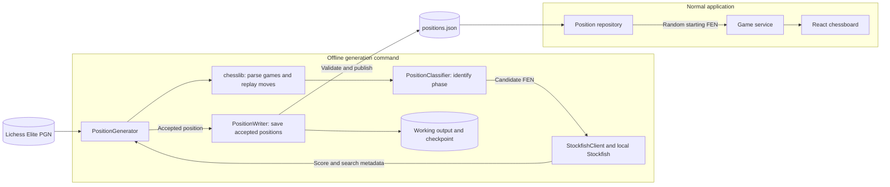
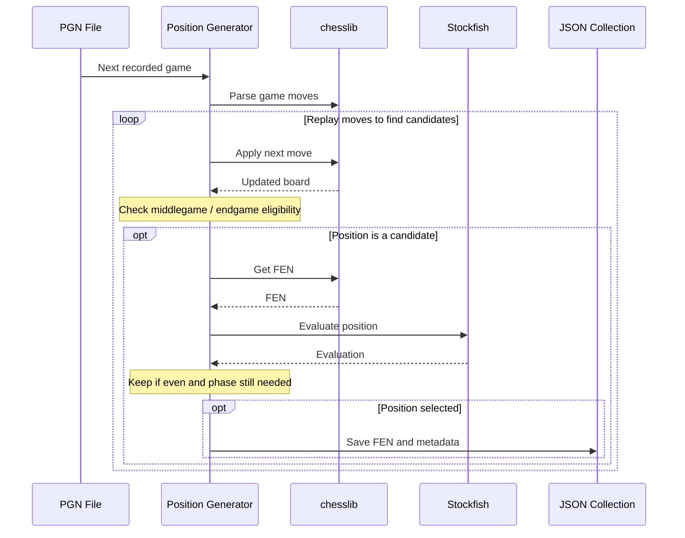

# Position Generation Workflow

## Purpose

Build a reusable collection of starting positions from real chess games. Stockfish runs offline during generation to find even positions; it does not run during normal gameplay or provide live evaluation.

This document records the workflow discussed after the V1 design document. Offline engine filtering is now intended for the initial position collection, updating the earlier plan to defer all engine analysis.

## Target and selection limits

- Target 1,000 unique positions: 500 middlegame and 500 endgame.
- Save at most two positions per source game: one per phase.
- A game may contribute zero, one, or two positions. Never force a selection to meet a quota.
- Once one phase reaches 500, continue searching only for the other phase.
- Stop when both quotas are met. If the input ends first, report the actual counts and shortfall.
- Deduplicate across games so repeated positions do not fill the collection.

Proposed initial filters, still subject to confirmation:

- Stockfish score between -50 and +50 centipawns, inclusive, normalized to White's perspective.
- Reject mate scores and positions where the game has already ended.

An even engine score at a finite search depth does not guarantee an easy position, several good moves, or the absence of a deeper forced mate.

## Pipeline

### System overview

The generator runs offline. The web application consumes only the published collection.



### Import sequence

Read this diagram from top to bottom. Each column represents a component involved in replaying one recorded game and selecting starting positions. Repeat this process for subsequent games until the collection is complete or the input ends.



Selection still follows the rules above: unique positions, at most one per phase per game, and 500 per phase overall. The proposed balance window is -50 to +50 centipawns, excluding mate scores. Error handling and checkpoint details are described below rather than shown in the diagram.

This represents the intended offline workflow; the current implementation only reads games. Restoring progress within a game must preserve its phase selections to avoid saving a second position for the same phase.

### 1. Read games

Use chesslib's PgnIterator to iterate through the PGN game by game. Do not load the entire file into memory. Close the iterator when finished.

Current source:

`ChessPGN/lichess_elite_2022-10.pgn`

The source is approximately 312 MB; its total game count has not been verified locally.

Dataset context: [Lichess Elite Database](https://database.nikonoel.fr/) (reviewed September 24, 2026).

- The publisher selects standard Lichess games and excludes bullet.
- From December 2021 onward, selection is 2500+ versus 2300+ rated players. This policy applies to the October 2022 download used here. Older files used 2400+ versus 2200+ thresholds.
- Rely on this source selection for player strength: do not add importer rating checks or require/store player ratings in generated position records. Missing rating tags do not disqualify a game.
- The publisher stores game links in the custom LichessURL tag from June 2020 onward. Read that tag for provenance rather than assuming Site contains the game URL; fall back to a source-file/game-index identifier if absent.
- Clock annotations are omitted by the publisher, so the importer must not depend on them.

Keep the dataset name, source URL, and source month in collection-level provenance. These are publisher-stated selection rules, not a completed audit of every local game. If a different source is introduced later, review its selection rules then. Strong-player selection does not establish position balance; offline Stockfish filtering still serves that purpose.

### 2. Replay moves

Use game.loadMoveText() and game.getHalfMoves() to obtain parsed moves. Create a new Board for each game and apply moves with board.doMove(...).

Standard games start from the standard board. Respect PGN setup/FEN headers for nonstandard starting positions, or explicitly skip those games in the first version. Unsupported variants must be skipped explicitly.

chesslib already parses PGN and generates FEN through board.getFen(); a custom notation parser or FEN generator is unnecessary.

Track ply (one move by one side) separately from full move number. If a game fails to parse or replay, record the failure and skip it rather than silently continuing with a corrupted board.

### 3. Classify and sample candidates

Classify positions after moves are applied. Proposed middlegame eligibility begins after full move 15 and ends when the endgame rule applies.

The design document suggests approximately 12-14 points of non-pawn material per side for endgames. The exact threshold, piece values, and treatment of asymmetric material remain to be decided. Phase rules should be mutually exclusive and configurable.

Do not automatically evaluate every ply. Establish a sampling policy and candidate limit per game to control analysis time. After accepting a position for a phase, stop evaluating that phase within the game.

### 4. Evaluate offline

A Stockfish client communicates with a local engine process using UCI. It supplies candidate positions and reads the completed search result.

Choose a consistent search budget before the full run. Record the engine version, relevant settings, requested budget, and achieved depth. Normalize score perspective before storing it, and distinguish centipawn scores from mate scores.

A timeout or engine failure is not a valid evaluation. Report it and retry or skip according to an explicit policy. Shut down the engine process when generation ends.

### 5. Save positions

Use JSON for the first collection. The normal backend loads the finished collection into memory and randomly selects from it. A database is not required for this size or access pattern.

Suggested position fields:

| Field | Meaning |
| --- | --- |
| id | Stable position identifier |
| fen | Complete FEN board state |
| phase | MIDDLEGAME or ENDGAME |
| sourceFile | Input PGN filename |
| sourceGameId | LichessURL link/ID when available, otherwise source filename plus game index |
| ply | Number of half-moves replayed in the source game |
| fullMoveNumber | Chess full move number at the position |
| evaluationCp | Centipawn score from White's perspective |
| engineVersion | Stockfish version used |
| analysisDepth | Achieved search depth |

Store shared generation settings and schema version at collection level. Optional context includes player names, source event, result, and preceding moves.

For deduplication, use board placement, side to move, castling rights, and normalized legal en passant availability. Move counters alone should not make an otherwise identical position unique. Preserve the complete original FEN in the saved record.

FEN includes move counters but not earlier repetition history. The dropped-in game starts fresh repetition tracking; handling inherited halfmove counters should be an explicit gameplay decision.

### 6. Resume and publish

Keep incremental output and checkpoint data separate from the final application resource. Save accepted positions, phase counts, processed source-game location, and generation settings so an interrupted run can resume. Replaying/skipping to a saved game index is acceptable initially; do not assume a text byte offset is a safe parser boundary.

Validate quotas, unique IDs/positions, required metadata, and loadable FENs before replacing the finished collection. Write the completed resource atomically where practical.

Proposed final resource:

`backend/src/main/resources/positions/positions.json`

The large source PGN, engine binary, and temporary analysis files should remain separate from that distributable collection.

## Project organization

Keep the generator in `com.dropinchess.positiongen` with a standalone main entry point. Run it explicitly, independently of Spring Boot startup and HTTP requests.

Suggested responsibilities as implementation grows:

- PositionGenerator: game iteration and overall workflow.
- PositionClassifier: phase eligibility.
- StockfishClient: engine communication and score handling.
- PositionWriter: output and checkpoints.
- GeneratedPosition: selected FEN and metadata.

The normal web backend only needs a position repository/loader. A later database implementation can replace JSON behind that boundary.

## Current progress and next steps

Completed:

- chesslib 1.3.7 is already a backend dependency.
- PositionGenerator has a standalone main method accepting the PGN path as args[0].
- The user successfully read three games and printed the player pairings.

Next implementation steps:

1. Replay those three games and inspect generated FENs.
2. Read source identifiers (including LichessURL) and explicitly handle unsupported inputs.
3. Finalize phase rules and identify candidate positions without running Stockfish.
4. Add Stockfish integration and test score perspective and mate-score handling.
5. Add per-game limits, global deduplication, JSON output, and checkpoints.
6. Run a small end-to-end sample before generating the full 500/500 collection.
7. Connect the finished collection to backend position selection.

## Running the current reader in IntelliJ

Open Run -> Edit Configurations, select PositionGenerator, and set Program arguments to:

```text
"C:\Users\Tim\Software Engineer Stuff\Drop In Chess\ChessPGN\lichess_elite_2022-10.pgn"
```

Run PositionGenerator.main(), not BackendApplication. The current three-game limit is a smoke check and must be replaced by quota/end-of-input handling for the full importer.

## Decisions still open

- Exact balance window.
- Precise middlegame/endgame definitions.
- Stockfish binary/version and analysis budget.
- Candidate sampling and selection policy within each phase.
- Resume/checkpoint format and failure handling.
- Whether near-terminal positions need additional exclusions beyond balance and legal continuation.


