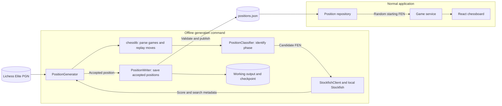
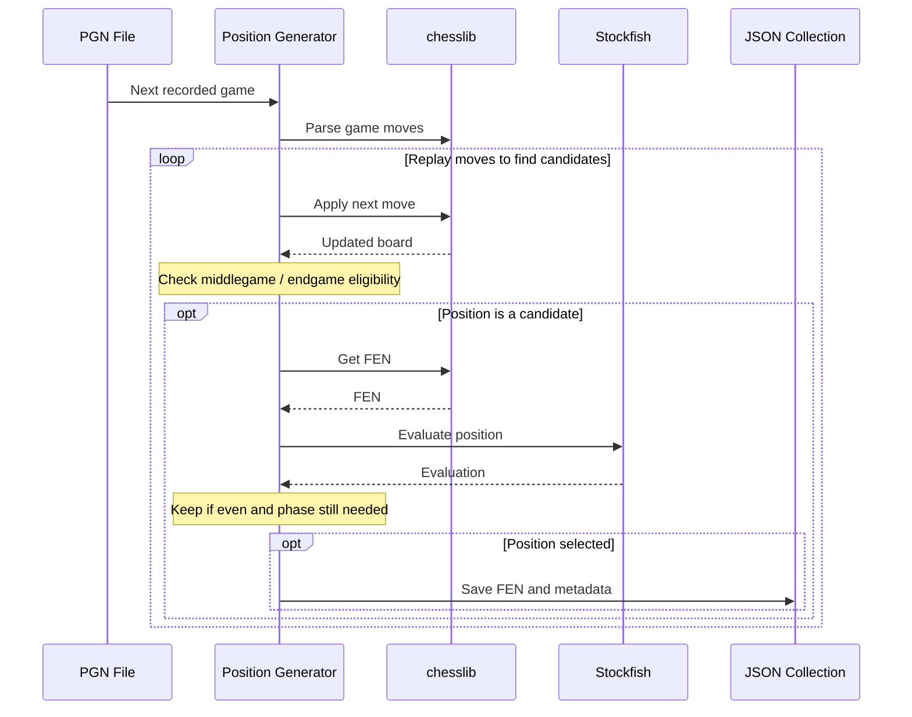

# Position Generation Workflow

## Purpose

Build a reusable collection of starting positions from real chess games. Stockfish runs offline during generation to find even positions; it does not run during normal gameplay or provide live evaluation.

This document records the workflow discussed after the V1 design document. Offline engine filtering is now intended for the initial position collection, updating the earlier plan to defer all engine analysis.

## Target and selection limits

- Target 1,000 unique positions: 500 middlegame and 500 endgame.
- Save at most two positions per source game: one per phase.
- A game may contribute zero, one, or two positions. Never force a selection to meet a quota.
- Once one phase reaches 500, continue searching only for the other phase.
- Stop when both quotas are met. If the input ends first, report the actual counts and shortfall.
- Deduplicate across games so repeated positions do not fill the collection.

Proposed initial filters, still subject to confirmation:

- Stockfish score between -50 and +50 centipawns, inclusive, normalized to White's perspective.
- Reject mate scores and positions where the game has already ended.

An even engine score at a finite search depth does not guarantee an easy position, several good moves, or the absence of a deeper forced mate.

## Pipeline

### System overview

The generator runs offline. The web application consumes only the published collection.



### Import sequence

Read this diagram from top to bottom. Each column represents a component involved in replaying one recorded game and selecting starting positions. Repeat this process for subsequent games until the collection is complete or the input ends.



Selection still follows the rules above: unique positions, at most one per phase per game, and 500 per phase overall. The proposed balance window is -50 to +50 centipawns, excluding mate scores. Error handling and checkpoint details are described below rather than shown in the diagram.

The generator now replays games, orders candidates, and evaluates them with Stockfish. JSON persistence remains pending. Restoring progress within a game must preserve its phase selections to avoid saving a second position for the same phase.

### 1. Read games

Use chesslib's PgnIterator to iterate through the PGN game by game. Do not load the entire file into memory. Close the iterator when finished.

Current source:

`ChessPGN/lichess_elite_2022-10.pgn`

The source is approximately 312 MB; its total game count has not been verified locally.

Dataset context: [Lichess Elite Database](https://database.nikonoel.fr/) (reviewed September 24, 2026).

- The publisher selects standard Lichess games and excludes bullet.
- From December 2021 onward, selection is 2500+ versus 2300+ rated players. This policy applies to the October 2022 download used here. Older files used 2400+ versus 2200+ thresholds.
- Rely on this source selection for player strength: do not add importer rating checks or require/store player ratings in generated position records. Missing rating tags do not disqualify a game.
- The publisher stores game links in the custom LichessURL tag from June 2020 onward. Read that tag for provenance rather than assuming Site contains the game URL; fall back to a source-file/game-index identifier if absent.
- Clock annotations are omitted by the publisher, so the importer must not depend on them.

Keep the dataset name, source URL, and source month in collection-level provenance. These are publisher-stated selection rules, not a completed audit of every local game. If a different source is introduced later, review its selection rules then. Strong-player selection does not establish position balance; offline Stockfish filtering still serves that purpose.

### 2. Replay moves

Use game.loadMoveText() and game.getHalfMoves() to obtain parsed moves. Create a new Board for each game and apply moves with board.doMove(...).

Standard games start from the standard board. Respect PGN setup/FEN headers for nonstandard starting positions, or explicitly skip those games in the first version. Unsupported variants must be skipped explicitly.

chesslib already parses PGN and generates FEN through board.getFen(); a custom notation parser or FEN generator is unnecessary.

Track ply (one move by one side) separately from full move number. If a game fails to parse or replay, record the failure and skip it rather than silently continuing with a corrupted board.

### 3. Classify and sample candidates

Classify positions after moves are applied. Proposed middlegame eligibility begins after full move 15 and ends when the endgame rule applies.

The design document suggests approximately 12-14 points of non-pawn material per side for endgames. The exact threshold, piece values, and treatment of asymmetric material remain to be decided. Phase rules should be mutually exclusive and configurable.

Do not automatically evaluate every ply. Establish a sampling policy and candidate limit per game to control analysis time. After accepting a position for a phase, stop evaluating that phase within the game.

### 4. Evaluate offline

A Stockfish client communicates with a local engine process using UCI. It supplies candidate positions and reads the completed search result.

Choose a consistent search budget before the full run. Record the engine version, relevant settings, requested budget, and achieved depth. Normalize score perspective before storing it, and distinguish centipawn scores from mate scores.

A timeout or engine failure is not a valid evaluation. Report it and retry or skip according to an explicit policy. Shut down the engine process when generation ends.

### 5. Save positions

Use JSON for the first collection. The normal backend loads the finished collection into memory and randomly selects from it. A database is not required for this size or access pattern.

Suggested position fields:

| Field | Meaning |
| --- | --- |
| id | Stable position identifier |
| fen | Complete FEN board state |
| phase | MIDDLEGAME or ENDGAME |
| sourceFile | Input PGN filename |
| sourceGameId | LichessURL link/ID when available, otherwise source filename plus game index |
| ply | Number of half-moves replayed in the source game |
| fullMoveNumber | Chess full move number at the position |
| evaluationCp | Centipawn score from White's perspective |
| engineVersion | Stockfish version used |
| analysisDepth | Achieved search depth |

Store shared generation settings and schema version at collection level. Optional context includes player names, source event, result, and preceding moves.

For deduplication, use board placement, side to move, castling rights, and normalized legal en passant availability. Move counters alone should not make an otherwise identical position unique. Preserve the complete original FEN in the saved record.

FEN includes move counters but not earlier repetition history. The dropped-in game starts fresh repetition tracking; handling inherited halfmove counters should be an explicit gameplay decision.

### 6. Resume and publish

Keep incremental output and checkpoint data separate from the final application resource. Save accepted positions, phase counts, processed source-game location, and generation settings so an interrupted run can resume. Replaying/skipping to a saved game index is acceptable initially; do not assume a text byte offset is a safe parser boundary.

Validate quotas, unique IDs/positions, required metadata, and loadable FENs before replacing the finished collection. Write the completed resource atomically where practical.

Proposed final resource:

`backend/src/main/resources/positions/positions.json`

The large source PGN, engine binary, and temporary analysis files should remain separate from that distributable collection.

## Project organization

Keep the generator in `com.dropinchess.positiongen` with a standalone main entry point. Run it explicitly, independently of Spring Boot startup and HTTP requests.

Suggested responsibilities as implementation grows:

- PositionGenerator: game iteration and overall workflow.
- PositionClassifier: phase eligibility.
- StockfishClient: engine communication and score handling.
- PositionWriter: output and checkpoints.
- GeneratedPosition: selected FEN and metadata.

The normal web backend only needs a position repository/loader. A later database implementation can replace JSON behind that boundary.

## Current progress and next steps

Completed:

- chesslib 1.3.7 is already a backend dependency.
- PositionGenerator has a standalone main method accepting the PGN path as args[0].
- The user successfully read three games and printed the player pairings.

Next implementation steps:

1. Replay those three games and inspect generated FENs.
2. Read source identifiers (including LichessURL) and explicitly handle unsupported inputs.
3. Finalize phase rules and identify candidate positions without running Stockfish.
4. Add Stockfish integration and test score perspective and mate-score handling.
5. Add per-game limits, global deduplication, JSON output, and checkpoints.
6. Run a small end-to-end sample before generating the full 500/500 collection.
7. Connect the finished collection to backend position selection.

## Running the current reader in IntelliJ

Open Run -> Edit Configurations, select PositionGenerator, and set Program arguments to:

```text
"C:\Users\Tim\Software Engineer Stuff\Drop In Chess\ChessPGN\lichess_elite_2022-10.pgn"
```

Run PositionGenerator.main(), not BackendApplication. The current three-game limit is a smoke check and must be replaced by quota/end-of-input handling for the full importer.

## Decisions still open

- Exact balance window.
- Precise middlegame/endgame definitions.
- Stockfish binary/version and analysis budget.
- Candidate sampling and selection policy within each phase.
- Resume/checkpoint format and failure handling.
- Whether near-terminal positions need additional exclusions beyond balance and legal continuation.


## Implemented candidate-selection trial

PositionGenerator now replays games, classifies positions, builds candidate search orders, and evaluates them through StockfishClient. It prints the first qualifying position per phase per game; no final collection is written yet.

Defaults are configurable: minimum full moves 15, range divisor 3, endgame material at most 13 points per side (knight/bishop 3, rook 5, queen 9; pawns/kings excluded). Already terminal/drawn positions are excluded. These are initial heuristics for the trial.

Middlegame random starts are sampled in plies from 30 through min(totalPlies, 2 * (15 + floor(totalFullMoves / 3))), inclusive. This permits either side to move. A middlegame start searches forward until an endgame or terminal position. An endgame/terminal start searches backward through eligible middlegames, never earlier than 30 plies. Endgames use a random eligible candidate and search forward among eligible endgames without wrapping.

Only one game's FEN snapshots are retained at a time. The seed makes trial runs reproducible. Custom starting FENs and nonstandard variants are explicitly skipped in this initial trial. Per-game replay errors are reported; iterator-level parse failures may still stop the run.

IntelliJ program arguments:

```text
"C:\Users\Tim\Software Engineer Stuff\Drop In Chess\ChessPGN\lichess_elite_2022-10.pgn" 100 42 15 3 13
```

Arguments after the path are optional: maxGames, seed, minimumMove, rangeDivisor, endgameMaterial. Supplying only the path now runs a 100-game trial.

The first 100 games with seed 42 produced 94 games with middlegame candidates and 52 with endgame candidates; 78 forward starts and 16 backward starts. Game-length percentiles were 17, 38, and 75.5 moves (p10/median/p90). First endgame candidate types were 5 pawn-only, 12 rook, 3 bishop, 2 mixed minor-piece, 3 queen, and 27 mixed. This is an initial contiguous sample, not a representative estimate of the whole dataset.

Next: implement global deduplication, 500/500 quotas, JSON output, and checkpoints. Selected ply, random start, search direction, score, depth, and evaluation count are now printed for each accepted position.


## Stockfish integration and engine trial

StockfishClient launches one reusable UCI engine process, waits for uciok/readyok, and reads the completed depth-limited search through bestmove. Settings are one thread, 64 MB hash, and MultiPV 1. Each candidate resets engine search history. Scores are normalized to White; mate and bound-only scores are not accepted. A process exit, missing score, or 60-second command/search timeout stops the run with an error and closes the engine.

PositionSelector walks each candidate plan in its existing order and returns the first score within +/-50 centipawns, inclusive. Defaults are depth 12 and at most 20 evaluations per phase per game. Exhausting the budget means no selection from that search, not proof that every remaining position is unbalanced. These settings are for the initial trial, not a guarantee of perfect balance.

The existing path-only IntelliJ configuration works when its working directory is the project root or backend: the engine is discovered under stockfish automatically. For an explicit 10-game trial:

```text
"C:\Users\Tim\Software Engineer Stuff\Drop In Chess\ChessPGN\lichess_elite_2022-10.pgn" 10 42 15 3 13 "C:\Users\Tim\Software Engineer Stuff\Drop In Chess\stockfish\stockfish-windows-x86-64-universal.exe" 12 20
```

All optional arguments in order: maxGames, seed, minimumMove, rangeDivisor, endgameMaterial, stockfishPath, depth, maxEvaluationsPerPhase. If the engine path is omitted it is discovered automatically; to customize depth, supply the preceding arguments including the explicit engine path.

Validation: 25 backend tests passed. A live Stockfish 19 trial on the first 10 games (seed 42, depth 12, budget 20) selected 5 middlegames and 4 endgames using 127 evaluations. Selected FENs and score metadata were printed. Global deduplication, collection quotas, and persistence were not applied.

## JSON export and resume (current implementation)

GeneratedPosition stores phase, optional endgame type, complete FEN, a stable SHA-256 position ID, source game index/LichessURL, starting FEN, the full preceding SAN move list, analysis score/depth, and random-start/direction/evaluation-count metadata. The SAN list ends exactly at the selected ply. Gameplay move history remains separate.

The collection has schemaVersion, generation settings, processedGames, complete, and positions. Generation settings include the source filename and SHA-256 fingerprint, engine version, depth, balance window, seed, phase heuristics, evaluation budget, target per phase, thread/hash settings, and sampling version. Existing output is resumed only when these settings match. maxGames may be increased to continue farther through the same input.

PositionWriter checkpoints after each completed or skipped game using a temporary file and atomic replacement where supported. An interrupted current game can be analyzed again; prior completed games need no repeated engine analysis. Restart skips to processedGames and reconstructs duplicate identities and phase counts from saved positions. Checkpoints retain partial collections with complete=false. They are not automatically installed as the application's runtime resource.

Sampling now uses a seed derived from the configured seed and source game index (per-game-v1), so resuming does not depend on replaying earlier random calls. This intentionally changes candidate starting points compared with the earlier single random stream; repeatability holds within this sampling version.

Duplicate detection ignores FEN move counters and normalizes en passant when no legal capture exists. Duplicates are skipped before evaluation. Each source game contributes at most one position per phase; a filled phase is no longer evaluated. Generation stops when both quotas are met, the input ends, or maxGames is reached.

Two trailing optional arguments were added: outputPath (default generated/positions.json, relative to the working directory) and targetPerPhase (default 500). A tested 10-game command from the backend working directory is:

```text
"C:\Users\Tim\Software Engineer Stuff\Drop In Chess\ChessPGN\lichess_elite_2022-10.pgn" 10 42 15 3 13 "C:\Users\Tim\Software Engineer Stuff\Drop In Chess\stockfish\stockfish-windows-x86-64-universal.exe" 12 20 "generated/positions-trial.json" 500
```

The trial file is backend/generated/positions-trial.json: 5 middlegames and 3 endgames from 10 processed games, with 115 engine evaluations. Every saved SAN history was replayed and checked against its FEN, phase, score limit, search depth, and stable ID. A repeat run loaded the file and performed zero additional engine evaluations. All 29 backend tests passed, including history round-trip, duplicate identity, restored quotas, settings mismatch, and duplicate-before-engine-budget checks.

The trial is intentionally incomplete relative to the 500/500 target. Increase maxGames with the same output/settings to continue, or choose a fresh output path for a new experiment. Source parser errors outside individual game handling still stop the run; the last completed checkpoint remains available.

## Endgame recent-progress filter

Endgame candidates are rejected before Stockfish when the FEN halfmove clock is 20 or greater: 20 half-moves is 10 full moves without a pawn move or capture. A pawn move or any capture resets this clock. Middlegames are unaffected, and no legal-pawn-move requirement is imposed.

Rejected candidates consume no engine budget; the existing search continues forward to the next candidate. Phase classification and random start selection are unchanged. Saved endgames are also checked against this rule during JSON validation.

The generation samplingVersion is now per-game-v1-endgame-halfmove-lt20 to prevent resuming older collections under different eligibility rules. Use a new output filename (for example generated/positions-progress20.json) to generate a comparison collection; existing exports are preserved.

Verification: all 31 backend tests passed, including clocks 19/20/43, reset clock 0, unchanged middlegame eligibility, and continuing past a rejected endgame without consuming engine budget. This rule addresses stale positions but does not guarantee interesting play.

## Source opening metadata

New selections include source.eco, source.opening, and source.variation, copied directly from chesslib's parsed ECO, Opening, and Variation PGN tags. These describe the source game's opening, not the selected position's current strategic theme. Missing tags remain null; combined opening names are preserved rather than split or inferred.

The fields are optional additions to schema version 1. Existing compatible checkpoints still load, but previously saved positions are not automatically backfilled. Use a new output filename to regenerate all entries with opening metadata. The existing settings/policy compatibility checks still apply.

## Generation duration

New collections store top-level elapsedMillis: cumulative wall-clock milliseconds across recorded run segments, excluding time between runs. Timing uses System.nanoTime and begins at main entry, including input hashing, engine startup, resume validation, and processing. Each checkpoint snapshots elapsed time before its own serialization; final file-write/shutdown overhead and work lost after the last checkpoint are not included. Repeated checkpoints within one run do not double-count elapsed time.

Divide elapsedMillis by 1000 for seconds or 60000 for minutes. Existing collections without timing load with unknown duration; future checkpoints keep elapsedMillis null because their earlier runtime cannot be reconstructed. Already completed exports are not rewritten merely by opening them. Start a fresh output to measure a complete generation run; no rerun is necessary to keep using existing positions.

## Backend use of the published collection

The completed backend/generated/v1-positions.json collection (500 middlegames and 500 endgames) is copied to backend/src/main/resources/positions/positions.json for application use. The generator output remains a separate checkpoint; generating more positions does not silently replace the runtime resource.

PositionRepository loads the packaged collection once at backend startup. It requires schema version 1, complete=true, a nonempty list, unique IDs, recognized phases, and playable FENs. Invalid or missing data prevents startup with a source-specific error rather than falling back to sample positions. The runtime projection retains ID, phase, and FEN; source history and opening metadata remain in the resource for future features.

POST /games and GET /startingFEN both draw uniformly from this shared repository. Their existing response shapes are unchanged. Games use a fresh board from the selected FEN, preserving its move counters but starting fresh repetition history; source moves are not replayed into the live game. Stockfish and the source PGN are not needed during gameplay.

Run BackendApplication in IntelliJ and use the frontend's normal Play action. Restart the backend after replacing the collection resource. For an external collection, set the Spring property dropinchess.positions.location, for example as a BackendApplication program argument:

```text
--dropinchess.positions.location=file:C:/Users/Tim/Software Engineer Stuff/Drop In Chess/backend/generated/v1-positions.json
```

Quote that entire argument when entering it in IntelliJ because it contains spaces. Default loading from classpath:positions/positions.json requires no extra arguments.

Validation: all 37 backend tests passed. Tests replay every published history, verify 1,000 unique positions and the 500/500 split, exercise both HTTP endpoints against the repository, and make a legal move from a generated start. Runtime startup only performs board validation, not history replay or engine analysis.
